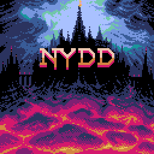
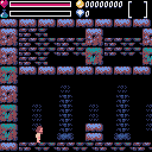

# Nydd

## Introduction
A dark mini-platform/RPG/adventure game written in Python and using the Pyxel engine.

## NOTE: This project was abandoned but I'm leaving the source code up for anyone that might be interested.

## Dependencies
- [Python](https://www.python.org/) 3.7 or higher.
- [Pyxel](https://github.com/kitao/pyxel) 1.8.15 or higher.

## Controls
- Move: Arrow keys
- Attack: Z
- Jump: X
- Start game/Pause: Enter
- Quit to main menu: Q
- Exit game: Escape

## Web play test (might be an old version)
- [Here](https://helpcomputer.github.io/pyxel/nydd/)

## Credits
- Designed by [helpcomputer0](https://twitter.com/helpcomputer0)
- Main title font by [Damien Guard](https://github.com/damieng)
